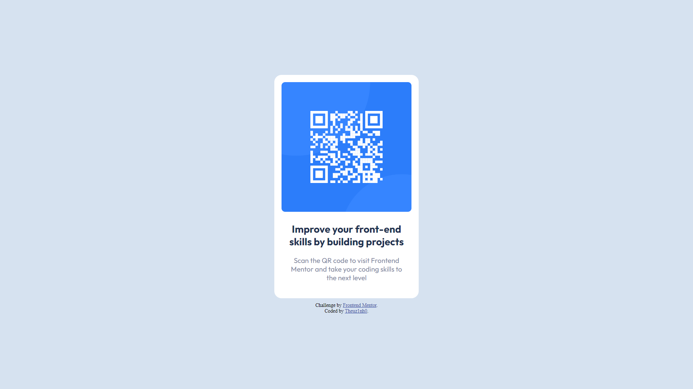

## Table of contents

- [Overview](#overview)
  - [Screenshot](#screenshot)
  - [Links](#links)
- [My process](#my-process)
  - [Built with](#built-with)
  - [What I learned](#what-i-learned)
  - [Useful resources](#useful-resources)
- [Author](#author)

## Overview

### Screenshot



### Links

- Solution URL: [Solution URL](https://github.com/Theuz1nh0/Frontend-Mentor-QR-code-component)
- Live Site URL: [Live site URL](https://theuz1nh0.github.io/Frontend-Mentor-QR-code-component/)

## My process

### Built with

- Semantic HTML5 markup
- Flexbox

### What I learned

```css
h1 {
    font-size: 1.4em;
}
```

### Useful resources

- [flexbox](https://css-tricks.com/snippets/css/a-guide-to-flexbox/) - this helped me to have a little more knowledge and control with flexbox.

## Author

- Linkedin - [Mateus Moura Domingos](https://www.linkedin.com/in/mateus-moura-domingos-462607243/)
- Frontend Mentor - [@Theuz1nh0](https://www.frontendmentor.io/profile/Theuz1nh0)
